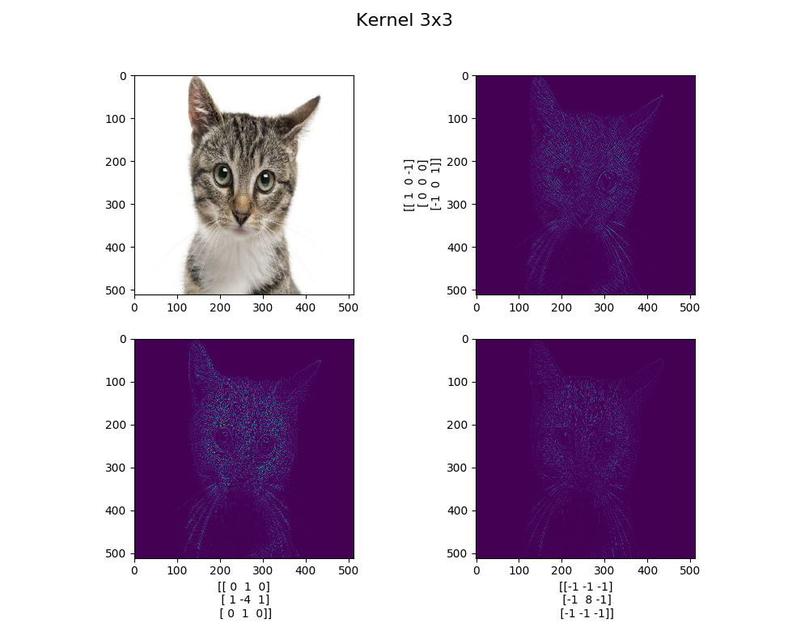
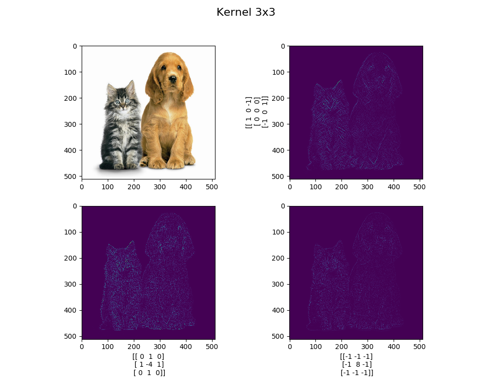
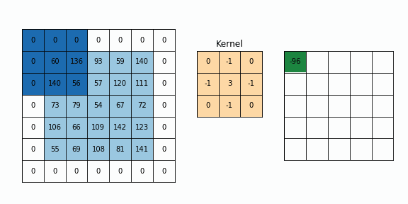

# Convolution with Python(numpy and scikit-image)


To show objects distinctly using the deep learning which is the actively using for last years. In this subject I have tried to show how to apply functions , passing through active functions. In the near future, we will gain in-depth knowledge of the results we have obtained in addition to these codes by developing an artificial neural network with a numpy library


### Requirements
python 3   
numpy 1.13.3  
scikit-image  
matplotlib 2.1.0

## Installation ##
>
    $ cd 2DConvolution
    $ pip3 install -r requirements.txt


### Data Visualization using Matplotlib

### for linux

>
    $ sudo apt-get install build-essential
    $ sudo apt-get install qtcreator
    $ sudo apt-get install qt5-default 


---------------------------------------------------
---------------------------------------------------


## Usage
  


```python3 main.py```  


-------------------------------


----------

# Kernel
* filter 3x3 



## Reference

* http://szeliski.org/Book/drafts/SzeliskiBook_20100903_draft.pdf
 
